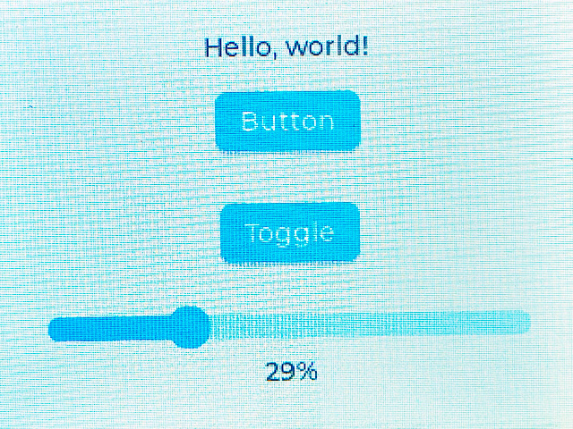
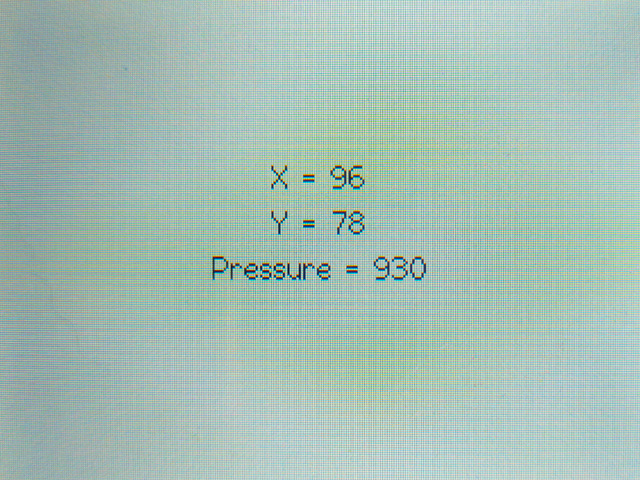
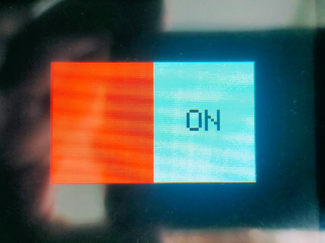
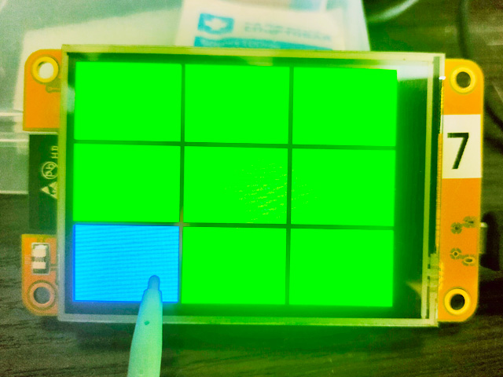

## YellowPrinter - подготовительные материалы

### Содержание

### [Знакомство с ESP-NOW 3.3.10](ESP-NOW3-3-10/ESP-NOW3-3-10.md)

### [ESP-NOW общее для ESP8266 и ESP32](#)

### [Как сделать скрoллинг дисплея](#%D0%BA%D0%B0%D0%BA-%D1%81%D0%B4%D0%B5%D0%BB%D0%B0%D1%82%D1%8C-%D1%81%D0%BA%D1%80%D0%BE%D0%BB%D0%BB%D0%B8%D0%BD%D0%B3-%D0%B4%D0%B8%D1%81%D0%BF%D0%BB%D0%B5%D1%8F)

### [Сенсорный экран, слайдер и клавиатура](#%D1%81%D0%B5%D0%BD%D1%81%D0%BE%D1%80%D0%BD%D1%8B%D0%B9-%D1%8D%D0%BA%D1%80%D0%B0%D0%BD---%D1%81%D0%BB%D0%B0%D0%B9%D0%B4%D0%B5%D1%80---%D0%BA%D0%BB%D0%B0%D0%B2%D0%B8%D0%B0%D1%82%D1%83%D1%80%D0%B0)

### [Память и другие параметры контроллеров](MemoryAndOther/MemoryAndOther.md)

### [Библиoграфия](#%D0%B1%D0%B8%D0%B1%D0%BB%D0%B8%D0%BE%D0%B3%D1%80%D0%B0%D1%84%D0%B8%D1%8F)

---

### [Знакомство с ESP-NOW](1_TrialEspnow/trial_espnow.md)

Пробы 29-30.06.2026 показали правила работы с интерфейсом ESP-NOW. Финальный вариант показал, как можно обеспечить передачу данных со стороннего контроллера по ESP-NOW на CYD и вывод текста с загружаемым шрифтом на дисплей:

- был запущен передатчик через ***Terminal v1.9b*** на ***AI Thinker ESP32-CAM*** в приложении: ***[Передача данных по протоколу ESP-NOW "один к одному"](trial_espnow/ESP_NOW_Serial/ESP_NOW_Serial.ino)***;

- на приеме и выводе на дисплей CYD работало приложение: ***[Принять сообщение по ESP-NOW и вывести его на экран загружаемым фонтом](CYD_GetPrint/CYD_GetPrint.ino)*** 

И тут естественным образом вылезла задача, как сделать скроллинг дисплея?

###### [к содержанию](#%D1%81%D0%BE%D0%B4%D0%B5%D1%80%D0%B6%D0%B0%D0%BD%D0%B8%D0%B5)

---

### [Как сделать скроллинг дисплея](#)

- Вначале ищем готовые решения. Попалось красивое решение на спрайтах с вертикально прокручиваемым текстом ***[TFT_eSPI_Scroll](https://github.com/xunicatt/TFT_eSPI_Scroll)***, как расширение библиотеки ***[TFT_eSPI](https://github.com/Bodmer/TFT_eSPI/)***.

Модифицированный штатный пример библиотеки ***[Скетч "Скроллинг дисплея"](TFT_eSPI_Scroll/Example1m/Example1m.ino)*** показал, что не работает кириллица, не с загружаемыми шрифтами, не с руссифицированным базовым ***glcdfont.c***.

- Пример, показывающий, как использовать библиотеку TFT_eSPI для создания ***[баннеров с горизонтально прокручиваемым текстом](https://github.com/Bodmer/TFT_eSPI/discussions/1828)***. После редактирования файла ***User_Setup.h*** в папке библиотеки TFT_eSPI в соответствии с дисплеем заработал ***[Скетч ''Создание горизонтального баннера"](TFT_eSPI_Scroll/Bodmer_TFT_eSPI/Bodmer_TFT_eSPI.ino)***.

###### [к содержанию](#%D1%81%D0%BE%D0%B4%D0%B5%D1%80%D0%B6%D0%B0%D0%BD%D0%B8%D0%B5)

---

### [Сенсорный экран - слайдер - клавиатура](#)

***Примеры от Rui Santos & Sara Santos:***

#### [DispTextCreateButSlider - управляющая кнопка, переключатель и прокрутка](SpriteScroll/DispTextCreateButSlider/DispTextCreateButSlider.ino)

Решение использует графическую библиотеку LVGL - удобно будет использовать с большим числом графических элементов, но занимает память.

#### [TestTouchscreen - координаты точки касания и сила нажатия](SpriteScroll/TestTouchscreen/TestTouchscreen.ino)

Демонстрация взаимодействия с сенсорным экраном.

#### [ButtonOnOff - активный переключатель](SpriteScroll/ButtonOnOff/ButtonOnOff.ino)

Активный переключатель "On/Off" на тачскрин.

***Прочие заготовки:***

#### [CYD_KeyPad - работа с клавиатурой](SpriteScroll/CYD_KeyPad/CYD_KeyPad.ino)

Представление клавиатуры и обработка нажатий на клавиши.

Скетч использует 339200 байт (25%) памяти устройства. Всего доступно 1310720 байт.
Глобальные переменные используют 23300 байт (7%) динамической памяти, оставляя 304380 байт для локальных переменных. Максимум: 327680 байт.

###### [к содержанию](#%D1%81%D0%BE%D0%B4%D0%B5%D1%80%D0%B6%D0%B0%D0%BD%D0%B8%D0%B5)

---

### Библиография

#### [Introduction to TFT_eSPI](https://doc-tft-espi.readthedocs.io/)

#### [Как отправлять данные с ESP32 на несколько плат ESP32 или ESP8266](https://voltiq.ru/esp-now-one-to-many-esp32-esp8266/)

#### [Русский текст на TFT SPI дисплее: гайд по настройке](https://voltiq.ru/tft-espi-russian-text/)

#### [Подключение сенсорного TFT дисплея к ESP32: Схема и пример кода](https://voltiq.ru/esp32-touchscreen-display-connection/)

#### [Легкая и универсальная графическая библиотека](https://github.com/lvgl/lvgl)

Легкая и универсальная графическая библиотека = Light and Versatile Graphics Library = LVGL.

#### [CYD-KeyPad](https://github.com/ElectriPixie/CYD-KeyPad/tree/main)

#### [Прокрутка текста без остановки](https://wokwi.com/projects/389861165064399873)

###### [к содержанию](#%D1%81%D0%BE%D0%B4%D0%B5%D1%80%D0%B6%D0%B0%D0%BD%D0%B8%D0%B5)

---

1

2

3

4

5

6

7

8

9

10

11

12

13

14

###### [к содержанию](#%D1%81%D0%BE%D0%B4%D0%B5%D1%80%D0%B6%D0%B0%D0%BD%D0%B8%D0%B5)
